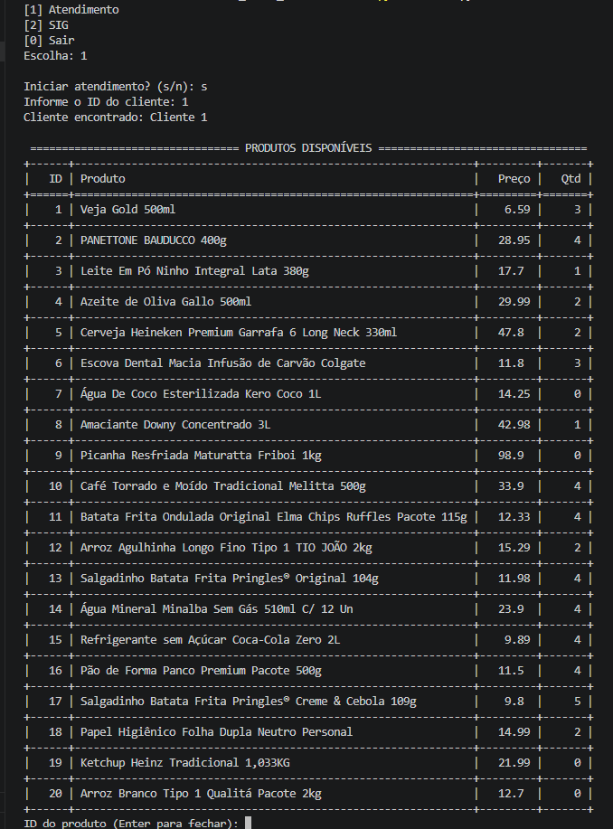
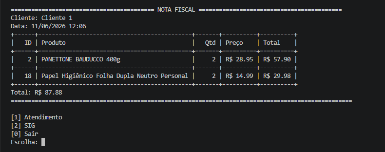
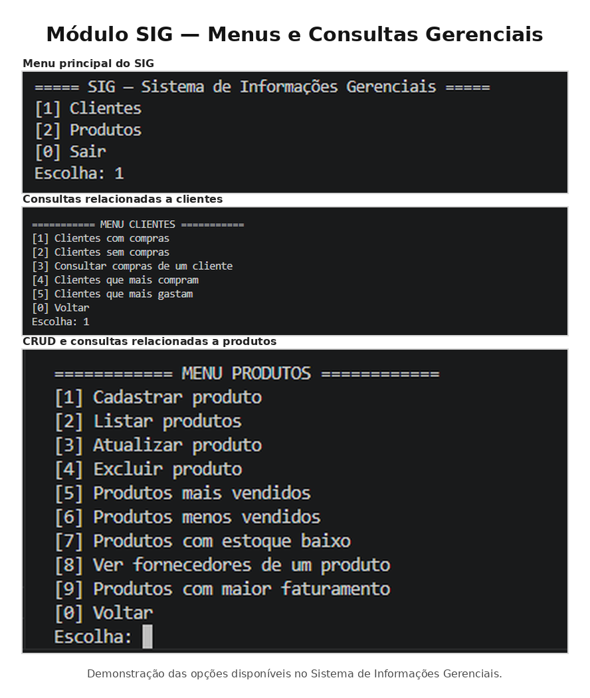
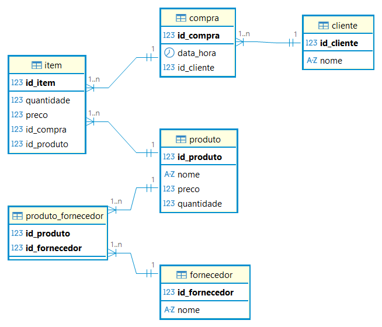

# Sistema de Mercado com SIG em Python

Sistema de mercado desenvolvido em **Python** com integração a banco de dados **SQLite**, criado para a disciplina **Banco de Dados + Python**.

O projeto simula o funcionamento de um ambiente comercial, contemplando registro de compras, controle de estoque, geração de nota fiscal simulada e consultas gerenciais por meio de um **SIG — Sistema de Informações Gerenciais**.

---

## Sobre o projeto

O sistema é dividido em dois módulos principais:

* **Caixa:** responsável pelo atendimento, registro das compras, agrupamento dos itens, baixa no estoque e geração da nota fiscal simulada.
* **SIG:** responsável por consultas e relatórios gerenciais relacionados a clientes, produtos, fornecedores, compras e faturamento.

A aplicação utiliza um banco de dados relacional para organizar as informações de clientes, produtos, fornecedores, compras e itens vendidos. Também são utilizados arquivos externos em formatos como **JSON**, **CSV** e **Excel** para importação e carga de dados.

---

## Funcionalidades

### Caixa

* Registro de compras por cliente;
* Listagem de produtos disponíveis;
* Agrupamento de itens repetidos com Pandas;
* Atualização automática do estoque;
* Geração de nota fiscal simulada;
* Gravação das compras no banco de dados.

### Sistema de Informações Gerenciais

* Consulta de clientes com compras;
* Consulta de clientes sem compras;
* Listagem de compras por cliente;
* Consulta de compra específica;
* Relatório de clientes que mais compram;
* Relatório de clientes que mais gastam;
* Cadastro, listagem, atualização e exclusão de produtos;
* Consulta de produtos mais vendidos;
* Consulta de produtos menos vendidos;
* Consulta de produtos com estoque baixo;
* Consulta de fornecedores por produto;
* Relatório de produtos com maior faturamento.

---

## Estrutura do projeto

| Arquivo                | Descrição                                                                      |
| ---------------------- | ------------------------------------------------------------------------------ |
| `models.py`            | Define as tabelas e os relacionamentos do banco de dados.                      |
| `caixa.py`             | Executa o módulo de atendimento e registro de compras.                         |
| `agrupar_itens.py`     | Agrupa produtos repetidos em uma mesma compra utilizando Pandas.               |
| `carregar_clientes.py` | Importa clientes a partir do arquivo `clientes.json`.                          |
| `web_scraping.py`      | Extrai dados do site indicado no enunciado e gera o arquivo `produtos.csv`.    |
| `carregar_produtos.py` | Importa produtos do arquivo `produtos.csv` para o banco de dados.              |
| `sig_caixa.py`         | Exibe o menu principal do SIG.                                                 |
| `sig_clientes.py`      | Reúne consultas e relatórios relacionados aos clientes.                        |
| `sig_produtos.py`      | Reúne o CRUD de produtos e consultas gerenciais.                               |
| `carregar_excel.py`    | Importa fornecedores e relações produto-fornecedor a partir da planilha Excel. |
| `fornecedores.xlsx`    | Contém os fornecedores e a relação entre produtos e fornecedores.              |
| `modelagens.pdf`       | Contém os modelos conceitual, lógico e físico do banco de dados.               |
| `mercado.db`           | Banco de dados SQLite populado com os dados do sistema.                        |

---

## Estrutura do Banco de Dados

O sistema utiliza um banco de dados SQLite chamado `mercado.db`, responsável por armazenar as informações de clientes, produtos, fornecedores, compras e itens vendidos.

A modelagem do banco foi organizada em três níveis:

* **Modelo Conceitual:** representa as principais entidades do sistema e seus relacionamentos;
* **Modelo Lógico:** define as tabelas, chaves primárias, chaves estrangeiras e relacionamentos;
* **Modelo Físico:** apresenta a implementação das tabelas em SQL.

A estrutura principal do banco é composta pelas seguintes tabelas:

| Tabela               | Finalidade                                                                            |
| -------------------- | ------------------------------------------------------------------------------------- |
| `cliente`            | Armazena os clientes cadastrados no sistema.                                          |
| `produto`            | Armazena os produtos disponíveis no mercado, incluindo preço e quantidade em estoque. |
| `fornecedor`         | Armazena os fornecedores dos produtos.                                                |
| `produto_fornecedor` | Representa o relacionamento N:N entre produtos e fornecedores.                        |
| `compra`             | Registra as compras realizadas pelos clientes.                                        |
| `item`               | Armazena os itens de cada compra, incluindo produto, quantidade e preço.              |

O relacionamento entre as tabelas permite registrar compras completas, controlar o estoque dos produtos e gerar consultas gerenciais no SIG.

---

## Funcionamento do Módulo Caixa

O módulo **Caixa** permite registrar compras de clientes diretamente pelo terminal. Durante o atendimento, o sistema identifica o cliente pelo ID, lista os produtos disponíveis, permite selecionar os itens da compra, atualiza o estoque e gera a nota fiscal simulada ao final do processo.



Nessa etapa, o operador informa o ID do produto desejado e a quantidade comprada. O sistema registra os itens da compra e realiza automaticamente os controles necessários no banco de dados.

---

## Nota Fiscal Simulada

Após a seleção dos produtos e a finalização do atendimento, o sistema gera uma nota fiscal simulada diretamente no terminal.

A nota apresenta as principais informações da compra, como cliente, data e hora, produtos adquiridos, quantidade, preço unitário, subtotal por item e valor total da compra.



Essa funcionalidade demonstra a integração entre o módulo de atendimento, o banco de dados e o controle de estoque, pois os itens registrados na compra são armazenados nas tabelas `compra` e `item`, enquanto a quantidade dos produtos é atualizada na tabela `produto`.

---

## Sistema de Informações Gerenciais

O sistema possui um **SIG — Sistema de Informações Gerenciais**, responsável por disponibilizar consultas e relatórios sobre clientes, produtos, compras e fornecedores.

O SIG é dividido em dois módulos principais:

* **Clientes:** permite consultar clientes com compras, clientes sem compras, compras específicas, clientes que mais compram e clientes que mais gastam.
* **Produtos:** permite realizar o CRUD de produtos, consultar produtos mais vendidos, menos vendidos, produtos com estoque baixo, fornecedores de um produto e produtos com maior faturamento.



---

## Modelo Relacional do Banco de Dados

O banco de dados foi estruturado para representar o funcionamento de um sistema de mercado, relacionando clientes, compras, itens, produtos e fornecedores.



O modelo apresenta as seguintes relações principais:

* Um `cliente` pode realizar várias `compras`;
* Uma `compra` pode possuir vários `itens`;
* Cada `item` está relacionado a um `produto`;
* Um `produto` pode estar associado a vários `fornecedores`;
* A tabela `produto_fornecedor` representa o relacionamento N:N entre produtos e fornecedores.

---

## Consulta gerencial extra

Foi implementada a consulta **Produtos com maior faturamento**, que calcula o valor total vendido por produto com base na quantidade vendida e no preço registrado em cada item da compra.

Essa consulta permite identificar os produtos com maior impacto financeiro no sistema.

---

## Como executar

Para registrar compras pelo caixa:

```bash
python caixa.py
```

Para acessar o SIG:

```bash
python sig_caixa.py
```

Para carregar fornecedores e associações entre produtos e fornecedores:

```bash
python carregar_excel.py
```

---

## Tecnologias utilizadas

* Python;
* SQLite;
* Pandas;
* JSON;
* CSV;
* Excel;
* Web Scraping;
* Modelagem de Banco de Dados.

---

## Objetivo acadêmico

Este projeto foi desenvolvido com finalidade acadêmica, aplicando conceitos de programação em Python, banco de dados relacional, modelagem de dados, manipulação de arquivos externos e consultas SQL para geração de informações gerenciais.
